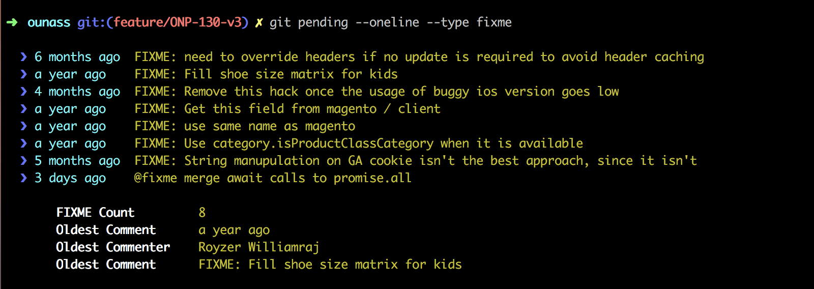
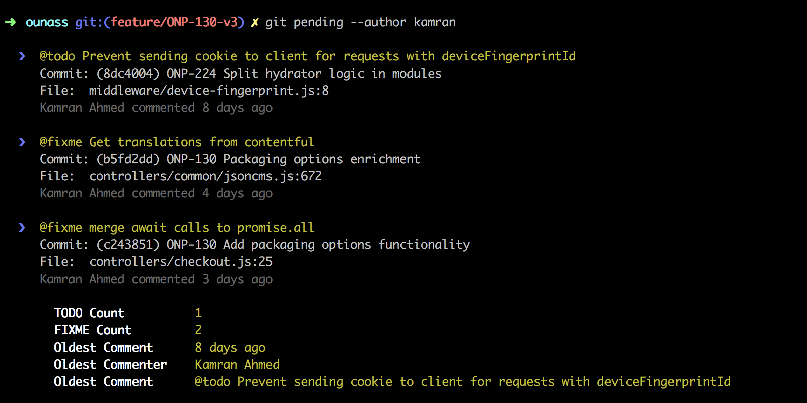

# git-pending
> Git plugin to list todo, fixme, testme and docme comments with verbose details



## Installation

Run the command below to install the plugin

```javascript
npm install -g git-pending
```

## Usage

Open any git repository and run below command

```bash
git pending
```
This will list all the pending `TODO`, `FIXME`, `TESTME` and `DOCME` comments

## Options
Here is the list of options that you can pass to modify the output of `git pending`

```bash
git pending [--oneline|-o ]
            [--type|-t <fixme|testme|docme|todo>]
            [--author|-a <author>]
            [--no-stats]
            [--strict]
            [--help]
            [--version]
```



## Examples

Here is the list of sample usage examples

```bash
git pending                     # All TODO, FIXME, DOCME or TESTME comments with commit details
git pending --no-stats          # Comments without stats
git pending --oneline           # Comments with only date
git pending --type fixme        # Only the fixme comments
git pending --author kamran     # Comments from specific author
git pending -t fixme -a kamran  # FIXME comments from specific author
git pending -t fixme -o         # Non-verbose fixme comments

# By default, it looks for text todo, fixme, testme and docme anywhere 
# in the comment. If you want to make the checks strict i.e. only match 
# @todo, @fixme, @testme and @docme, then use --strict flag
git pending --strict

```

### Comments by Single Author

> If you don't pass `--author` flag, it will show you the comments from everyone

```bash
git pending --author kamran --oneline
```


### Comments with Commit Details

> Not passing `--oneline` flag will give you the detailed output with commit that introduced the comment

```bash
git pending --author kamran
```


### Comments of Specific Type

> Use `--type` flag to specify the type of comments you need. Possible values (`TODO`, `FIXME`, `TESTME`, `DOCME`)

```bash
git pending --type TODO
git pending --type TESTME
git pending --type FIXME
git pending --type DOCME
```


## License
MIT &copy; [Kamran Ahmed](https://twitter.com/kamranahmedse)
